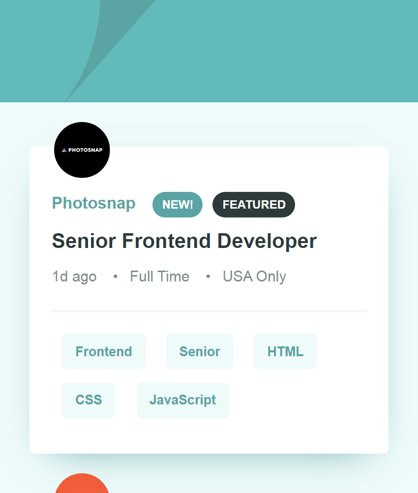
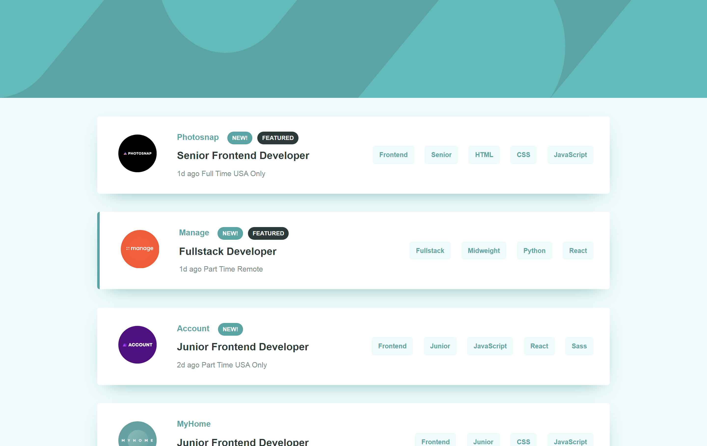

# Frontend Mentor - Job listings with filtering solution

This is a solution to the [Job listings with filtering challenge on Frontend Mentor](https://www.frontendmentor.io/challenges/job-listings-with-filtering-ivstIPCt). Frontend Mentor challenges help you improve your coding skills by building realistic projects. 

## Table of contents

- [Overview](#overview)
  - [The challenge](#the-challenge)
  - [Screenshot](#screenshot)
  - [Links](#links)
- [My process](#my-process)
  - [Built with](#built-with)
  - [What I learned](#what-i-learned)
  - [Continued development](#continued-development)
  - [Useful resources](#useful-resources)
- [Author](#author)
- [Acknowledgments](#acknowledgments)

## Overview

### The challenge

Users should be able to:

- View the optimal layout for the site depending on their device's screen size
- See hover states for all interactive elements on the page
- Filter job listings based on the categories

### Screenshot




### Links

- Solution URL: [Add solution URL here](https://your-solution-url.com)
- Live Site URL: [Add live site URL here](https://your-live-site-url.com)

## My process

### Built with

- Semantic HTML5 markup
- CSS custom properties
- Flexbox
- Mobile-first workflow
- [React](https://reactjs.org/) - JS library

### What I learned

Basically, this is my first react project after learning the basics of react ,a javaScript library. During the processing of coding this project, i learnt more about react hooks such as useEffect hook for fetching json data from a locl directory, the useState hook for initializing a component state, passing props(data) from parent component to any child component in the DOM tree or from child component to parent component as well as passing parameter to a function using ES6 arrow function.

Secondly, I understood very much the folder structure of create-react-app, loop through an array using map method and filter an array using the filter method.

To see how you can add code snippets, see below:


```js
// useEffect
useEffect(() => {
    fetch("data/data.json")
      .then(res => {
        return res.json();
      })
      .then(data => {
        setJobs(data);
      });
  }, []);

// filter an array 
  const removeKeyword = value => {
    const newSearch = keywords.filter(keywords => keywords !== value);
    setKeyword(newSearch);
  };

  // the map method and passing props to child component
  const displayKeyword = keywords.map(keyword => {
    return (
      <ListKeyword
        keyword={keyword}
        key={keyword}
        handleRemoveKeyword={removeKeyword}
      />
    );
  });
}
```

### Continued development
- react-router-dom
- State management with react redux

### Useful resources

- [Example resource 1](https://reactjs.org/) - This helped me for difference between state, props and map method.

## Author

- Frontend Mentor - [@yourusername](https://www.frontendmentor.io/profile/yourusername)
- Twitter - [@yourusername](https://www.twitter.com/yourusername)
